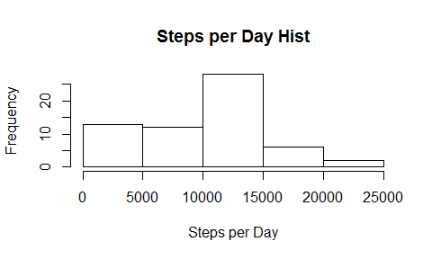

# Reproducible Research: Peer Assessment 1


## Loading and preprocessing the data


```r
library(data.table)
library(dplyr)
```

```
## 
## Attaching package: 'dplyr'
## 
## The following objects are masked from 'package:data.table':
## 
##     between, last
## 
## The following object is masked from 'package:stats':
## 
##     filter
## 
## The following objects are masked from 'package:base':
## 
##     intersect, setdiff, setequal, union
```

```r
data <- fread("activity.csv", header = T)
print(head(data))
```

```
##    steps       date interval
## 1:    NA 2012-10-01        0
## 2:    NA 2012-10-01        5
## 3:    NA 2012-10-01       10
## 4:    NA 2012-10-01       15
## 5:    NA 2012-10-01       20
## 6:    NA 2012-10-01       25
```


## What is mean total number of steps taken per day?

1. Calculate the total number of steps taken per day


```r
steps_per_date <- data %>% group_by(date) %>% summarise(steps=sum(steps, na.rm=T))
print(head(steps_per_date))
```

```
##         date steps
## 1 2012-10-01     0
## 2 2012-10-02   126
## 3 2012-10-03 11352
## 4 2012-10-04 12116
## 5 2012-10-05 13294
## 6 2012-10-06 15420
```

2. Make a histogram of the total number of steps taken each day


```r
hist(steps_per_date$steps)
```

 

3. Calculate and report the mean and median of the total number of steps taken per day


```r
print(paste("Mean of steps per day:", mean(steps_per_date$steps)))
```

```
## [1] "Mean of steps per day: 9354.22950819672"
```

```r
print(paste("Median of steps per day:", median(steps_per_date$steps)))
```

```
## [1] "Median of steps per day: 10395"
```


## What is the average daily activity pattern?


## Imputing missing values


## Are there differences in activity patterns between weekdays and weekends?
