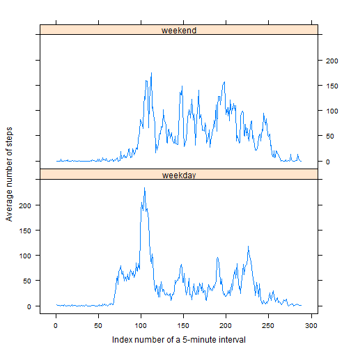

## Introduction

This assignment makes use of data from a personal activity monitoring device. This device collects data at 5 minute intervals through out the day. The data consists of two months of data from an anonymous individual collected during the months of October and November, 2012 and include the number of steps taken in 5 minute intervals each day.

## Loading and preprocessing the data


```r
library(data.table)
library(dplyr)
data <- fread("activity.csv", header = T)
data <- data %>% 
        mutate(interval_index=floor(interval/100)*60/5+(interval/100-floor(interval/100))*100/5+1)
print(head(data, n=3))
```

```
##    steps       date interval interval_index
## 1:    NA 2012-10-01        0              1
## 2:    NA 2012-10-01        5              2
## 3:    NA 2012-10-01       10              3
```

## What is mean total number of steps taken per day?

1. Calculate the total number of steps taken per day


```r
steps_per_date <- data %>% group_by(date) %>% summarise(steps=sum(steps, na.rm=T))
print(head(steps_per_date, n=3))
```

```
##         date steps
## 1 2012-10-01     0
## 2 2012-10-02   126
## 3 2012-10-03 11352
```

2. Make a histogram of the total number of steps taken each day


```r
hist(steps_per_date$steps, 
     main="Steps per Day Hist", xlab="Steps per Day")
```

 

3. Calculate and report the mean and median of the total number of steps taken per day


```r
mean_steps <- mean(steps_per_date$steps)
median_steps <- median(steps_per_date$steps)
```

The mean total number of steps taken per day is **9354.2295082** and the median is **10395**.


## What is the average daily activity pattern?

1. Make a time series plot (i.e. type = "l") of the 5-minute interval (x-axis) and the average number of steps taken, averaged across all days (y-axis)


```r
steps_per_interval <- data %>% 
        group_by(interval_index, interval) %>% 
        summarise(avg_steps=mean(steps, na.rm=T))

plot(steps_per_interval$interval_index, 
     steps_per_interval$avg_steps, 
     type="l", 
     main="Number of steps per a 5-minute interval, averaged across all days", 
     xlab="Index number of a 5-minute interval", 
     ylab="Average number of steps")
```

 

2. Which 5-minute interval, on average across all the days in the dataset, contains the maximum number of steps?


```r
max_steps <- max(steps_per_interval$avg_steps)
max_steps_interval_index <- which(steps_per_interval$avg_steps==max_steps)
max_steps_time <- steps_per_interval$interval[max_steps_interval_index]
```

The interval **835** (the **104th** 5-minute interval) contains **206.1698113** steps, which is the maximum number of steps on average across all the days in the dataset.

## Imputing missing values

1. Calculate and report the total number of missing values in the dataset (i.e. the total number of rows with `NA`s)


```r
missing_data <- data %>% filter(is.na(steps))
number_of_missing <- (nrow(missing_data))
```

The total number of missing values in the dataset is **2304**.

2. Devise a strategy for filling in all of the missing values in the dataset. The strategy does not need to be sophisticated. For example, you could use the mean/median for that day, or the mean for that 5-minute interval, etc.

**The strategy is to use the mean for that 5-minute interval.**  

3. Create a new dataset that is equal to the original dataset but with the missing data filled in.


```r
data_new <- inner_join(data, steps_per_interval, by = "interval_index")
data_new <- data_new %>% 
        mutate(steps_new=ifelse(is.na(steps), avg_steps, steps)) %>%
        mutate(interval=interval.x) %>%
        select(date, interval, interval_index, steps, avg_steps, steps_new)
print(head(data_new, n=3))
```

```
##         date interval interval_index steps avg_steps steps_new
## 1 2012-10-01        0              1    NA  1.716981  1.716981
## 2 2012-10-02        0              1     0  1.716981  0.000000
## 3 2012-10-03        0              1     0  1.716981  0.000000
```

```r
print(tail(data_new, n=3))
```

```
## Source: local data frame [3 x 6]
## 
##         date interval interval_index steps avg_steps steps_new
## 1 2012-11-28     2355            288     0  1.075472  0.000000
## 2 2012-11-29     2355            288     0  1.075472  0.000000
## 3 2012-11-30     2355            288    NA  1.075472  1.075472
```

4. Make a histogram of the total number of steps taken each day and Calculate and report the **mean** and **median** total number of steps taken per day. Do these values differ from the estimates from the first part of the assignment? What is the impact of imputing missing data on the estimates of the total daily number of steps?


```r
steps_new_per_date <- data_new %>% 
        group_by(date) %>% 
        summarise(steps_new=sum(steps_new, na.rm=T))
par(mfrow=c(1,2))
hist(steps_per_date$steps, ylim=c(0,40), 
     main="Steps per Day Hist with NA", xlab="Steps per Day")
hist(steps_new_per_date$steps_new, ylim=c(0,40), 
     main="Steps per Day Hist with filled in NA", xlab="Steps per Day")
```

 

The impact of imputing missing data using average number of steps per 5 minute interval is more days with number of steps between 10000 and 15000 and less days with very few and very high number of steps.

## Are there differences in activity patterns between weekdays and weekends?

1. Create a new factor variable in the dataset with two levels -- "weekday" and "weekend" indicating whether a given date is a weekday or weekend day.


```r
data_weekdays <- data %>% 
        mutate(weekday=ifelse(as.POSIXlt(date)$wday==0|as.POSIXlt(date)$wday==6, "weekend", "weekday")) %>%
        group_by(weekday, interval_index)
print(head(data_weekdays, n=6))
```

```
##   steps       date interval interval_index weekday
## 1    NA 2012-10-01        0              1 weekday
## 2    NA 2012-10-01        5              2 weekday
## 3    NA 2012-10-01       10              3 weekday
## 4    NA 2012-10-01       15              4 weekday
## 5    NA 2012-10-01       20              5 weekday
## 6    NA 2012-10-01       25              6 weekday
```

2. Make a panel plot containing a time series plot (i.e. `type = "l"`) of the 5-minute interval (x-axis) and the average number of steps taken, averaged across all weekday days or weekend days (y-axis). 


```r
steps_per_weekdays <- data_weekdays %>% 
        summarise(avg_steps=mean(steps, na.rm=T))

library(lattice)
xyplot(avg_steps~interval_index | factor(weekday), data=steps_per_weekdays, 
       pch="", type='b', layout=c(1,2),
       xlab="Index number of a 5-minute interval",  
       ylab="Average number of steps")
```

 
